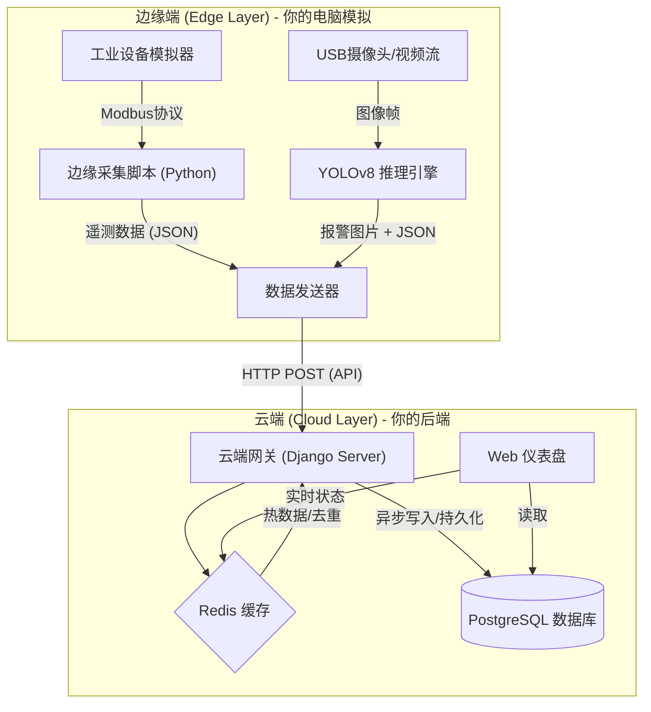

# 🏭 项目名称：工业级 AIoT 安全监测与设备管理平台
### (Industrial AIoT Sentinel Platform)

---

### 1. 项目背景与简介 (Introduction)

**“让传统工厂拥有智慧大脑。”**

在现代工业 4.0 场景下，工厂面临两大痛点：一是老旧设备（PLC）数据孤岛，难以联网；二是生产安全（如工人未戴安全帽、火灾隐患）依赖人工巡检，效率低下。

本项目是一个**端云协同（Edge-Cloud Collaboration）的工业物联网平台**。
它利用**边缘计算**技术，在设备端实时采集 Modbus 工业协议数据并运行 YOLO 视觉算法；通过**云端 Django 后端**实现数据的统一接入、清洗、存储与可视化监控。

**核心价值**：
*   **实时性**：毫秒级采集设备温度、转速等遥测数据。
*   **智能化**：通过计算机视觉自动识别现场安全隐患并报警。
*   **低成本**：纯软件方案兼容各类工控机，无需昂贵专有硬件。

---

### 2. 技术栈架构 (Tech Stack)

这个项目完美覆盖了你的技能树，实现了从底层硬件协议到上层 Web 应用的全栈贯通。

| 层级 | 关键技术 | 作用描述 |
| :--- | :--- | :--- |
| **云端后端 (Server)** | **Python, Django 4.2** | 核心业务逻辑，ORM 数据建模，Admin 后台管理 |
| | **Django REST Framework (DRF)** | 构建 RESTful API，处理前后端分离的高并发请求 |
| | **Redis** | 高速缓存（存储设备在线状态）、消息队列中间件 |
| **数据库 (DB)** | **PostgreSQL 15** | 存储设备元数据、时序遥测历史、报警日志 |
| **边缘端 (Edge)** | **Python, OpenCV** | 视频流采集与图像处理 |
| | **YOLOv8 / Ultralytics** | 边缘侧 AI 推理（安全帽/火焰检测） |
| | **PyModbus** | 工业协议驱动，模拟 PLC 寄存器读写 |
| **基础设施 (Infra)** | **Docker & Compose** | 数据库与缓存服务的容器化编排 |
| **前端 (Web)** | **Django Templates + Echarts** | 服务端渲染页面，数据可视化大屏展示 |

---

### 3. 系统架构设计 (System Architecture)

我们将系统划分为**边缘侧 (Edge)** 和 **云端侧 (Cloud)** 两大部分，通过 HTTP/REST API 进行通信。



---

### 4. 核心功能模块 (Core Features)

1.  **设备接入与管理 (Device Management)**
    *   支持设备的注册、鉴权（DeviceID/Token）。
    *   实时监控设备在线/离线状态（利用 Redis 心跳机制）。

2.  **工业数据遥测 (Telemetry Ingestion)**
    *   高频接收设备上传的温度、压力、转速数据。
    *   支持 Modbus 协议数据的解析与标准化。

3.  **AI 视觉报警 (AI Visual Alert)**
    *   边缘端实时检测异常（如：检测到火焰）。
    *   自动上传报警截图、置信度、时间戳。
    *   云端生成报警日志并通知。

4.  **数据可视化大屏 (Dashboard)**
    *   展示最近 1 小时的温度变化曲线。
    *   展示最新的 AI 报警抓拍图片。

---

### 5. 你的开发环境准备 (Prerequisites)

为了实现“零硬件成本”开发，我们采用**全软件仿真**方案。

*   **操作系统**: Windows / macOS / Linux 均可。
*   **Python 环境**: Conda (建议 Python 3.10)。
*   **容器环境**: Docker Desktop (用于跑数据库)。
*   **IDE**: VS Code 或 PyCharm。

---

**（以下是之前提供的详细教程步骤，现在你可以按照这个文档开始搭建了！）**

### Phase 1: 基础设施搭建 (Docker + Django)

我们直接按生产标准，用 Docker Compose 编排数据库和应用。

**1. 目录结构**:
```text
aiot_platform/
├── backend/ (Django项目)
│   ├── Dockerfile
│   ├── core/ (settings, urls)
│   └── devices/ (主要app)
├── docker-compose.yml
└── edge_client/ (模拟边缘端脚本)
```

**2. 编写 `docker-compose.yml`**:
在项目根目录创建此文件，启动数据库和缓存：

```yaml
version: '3.8'

services:
  # 1. 模拟云端数据库 (PostgreSQL)
  db:
    image: postgres:15
    container_name: aiot_postgres
    environment:
      - POSTGRES_DB=aiot_db
      - POSTGRES_USER=aiot_user
      - POSTGRES_PASSWORD=aiot_password
    ports:
      - "5432:5432"
    volumes:
      - postgres_data:/var/lib/postgresql/data

  # 2. 模拟高速缓存 (Redis)
  redis:
    image: redis:7
    container_name: aiot_redis
    ports:
      - "6379:6379"

volumes:
  postgres_data:
```
运行命令启动：`docker-compose up -d`

**3. Django 初始化**:
```bash
# 进入 backend 目录 (假设你已经用 django-admin startproject core . 创建好了项目)
# 创建核心 App
python manage.py startapp devices
```

---

### Phase 2: 核心数据模型 (Models)

在 `backend/devices/models.py` 中设计模型。这展示了你对关系型数据库设计的理解。

```python
from django.db import models

class Device(models.Model):
    """边缘设备/网关元数据"""
    name = models.CharField("设备名称", max_length=100)
    device_uid = models.CharField("设备唯一码", max_length=64, unique=True, help_text="硬件指纹")
    ip_address = models.GenericIPAddressField("IP地址", null=True, blank=True)
    is_active = models.BooleanField("是否启用", default=True)
    created_at = models.DateTimeField(auto_now_add=True)

    def __str__(self):
        return f"{self.name} ({self.device_uid})"

class Telemetry(models.Model):
    """时序遥测数据"""
    device = models.ForeignKey(Device, on_delete=models.CASCADE, related_name='telemetries')
    # 使用 JSONField 存储非结构化数据，适应不同传感器的变化
    data = models.JSONField("遥测数据") # e.g. {"temp": 45.2, "rpm": 1200}
    timestamp = models.DateTimeField(auto_now_add=True, db_index=True)

class AlarmLog(models.Model):
    """AI 报警记录"""
    device = models.ForeignKey(Device, on_delete=models.CASCADE)
    alarm_type = models.CharField("报警类型", max_length=50) # e.g., "fire", "no_mask"
    confidence = models.FloatField("AI置信度")
    image = models.ImageField("现场截图", upload_to='alarms/%Y/%m/')
    timestamp = models.DateTimeField(auto_now_add=True)
```

记得执行迁移：
```bash
python manage.py makemigrations
python manage.py migrate
```

---

### Phase 3: 开发高性能接口 (DRF Views)

在 `backend/devices/views.py` 中编写接口。这里我们加入 **Redis** 来处理设备的心跳状态，减少数据库压力。

```python
from rest_framework.views import APIView
from rest_framework.response import Response
from rest_framework import status
from django.core.cache import cache
from .models import Device, Telemetry

class DeviceHeartbeatView(APIView):
    """
    接收边缘端数据上报
    Endpoint: POST /api/v1/telemetry/
    Payload Example: {"uid": "SIM_001", "data": {"temp": 60, "rpm": 1200}}
    """
    def post(self, request):
        uid = request.data.get('uid')
        payload = request.data.get('data')

        if not uid or not payload:
            return Response({"error": "Invalid format"}, status=400)

        # 1. 缓存优先策略：检查设备是否存在
        # 键名设计：device_id_{uid}
        cache_key = f"device_id_{uid}"
        device_id = cache.get(cache_key)

        if not device_id:
            try:
                device = Device.objects.get(device_uid=uid)
                device_id = device.id
                # 缓存设备ID 1小时，避免每次请求都查数据库
                cache.set(cache_key, device.id, 3600)
            except Device.DoesNotExist:
                return Response({"error": "Device not registered"}, status=404)

        # 2. 更新在线状态 (存入 Redis，有效期 60秒)
        # 前端查询在线状态时，直接查这个 Key，不用查库
        cache.set(f"device_online_{uid}", "online", 60)

        # 3. 数据入库
        Telemetry.objects.create(device_id=device_id, data=payload)

        return Response({"status": "received", "device": uid})
```

配置 URL (`backend/devices/urls.py`):
```python
from django.urls import path
from .views import DeviceHeartbeatView

urlpatterns = [
    path('telemetry/', DeviceHeartbeatView.as_view(), name='device_telemetry'),
]
```

---

### Phase 4: 边缘端仿真 (Edge Simulation)

现在，在 `edge_client/` 文件夹下，创建 `simulator.py`。
这个脚本集成了你所有的“硬技能”：模拟 Modbus 数据 + 模拟 AI 逻辑。

```python
import time
import requests
import random
import json

# 配置
SERVER_URL = "http://127.0.0.1:8000/api/v1/devices/telemetry/"
DEVICE_UID = "SIM_FACTORY_01"

def simulate_modbus_read():
    """模拟从 PLC 读取寄存器"""
    # 模拟温度波动：50度上下浮动
    temp = 50 + random.uniform(-5, 5)
    # 模拟转速
    rpm = random.randint(1000, 3000)
    return {"temp": round(temp, 2), "rpm": rpm}

def simulate_yolo_check():
    """模拟 AI 检测逻辑"""
    # 1% 的概率检测到火灾
    if random.random() < 0.01:
        return True
    return False

def main():
    print(f"🚀 启动边缘网关模拟器 [{DEVICE_UID}]...")
    
    while True:
        # 1. 采集数据
        sensor_data = simulate_modbus_read()
        
        # 2. AI 检测 (如果是真机，这里会调用 model(frame))
        has_fire = simulate_yolo_check()
        if has_fire:
            print("🔥 警告：检测到火灾隐患！(模拟报警上传)")
            # 可以在这里扩展报警上传接口的代码
        
        # 3. 构造 Payload
        payload = {
            "uid": DEVICE_UID,
            "data": sensor_data
        }
        
        # 4. 发送给 Django
        try:
            resp = requests.post(SERVER_URL, json=payload, timeout=2)
            if resp.status_code == 200:
                print(f"✅ 上传成功: {sensor_data}")
            else:
                print(f"❌ 服务器拒绝: {resp.status_code} - {resp.text}")
        except Exception as e:
            print(f"⚠️ 连接失败: Is Django running? {e}")

        # 模拟 2秒采集一次
        time.sleep(2)

if __name__ == "__main__":
    main()
```

---

### Phase 5: 验证与运行

1.  **启动 Docker**: `docker-compose up -d` (确保 Postgres/Redis 亮绿灯)。
2.  **启动 Django**:
    *   记得先在 Django Admin (`/admin`) 里手动创建一个 Device，UID 填 `SIM_FACTORY_01`，否则接口会报 404 设备未注册。
    *   `python manage.py runserver`
3.  **启动模拟器**:
    *   `python edge_client/simulator.py`
4.  **查看成果**:
    *   模拟器终端应该显示“✅ 上传成功”。
    *   使用 DBeaver 查看 `devices_telemetry` 表，数据应该在源源不断地增加。

这就是一个完整的、闭环的、拥有工业背景的 AIoT 项目雏形！
