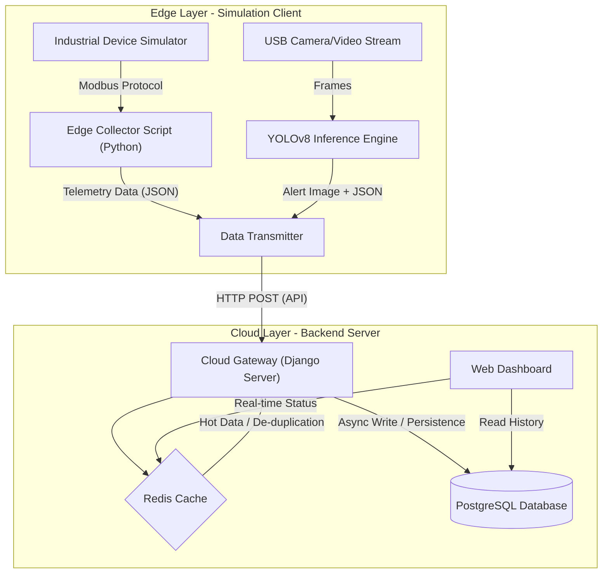

# 🏭 Industrial AIoT Sentinel Platform

**English** | [简体中文](README_CN.md)

### 1. Introduction

**"Empowering traditional factories with a smart brain."**

In the Industry 4.0 era, factories face two major pain points: **Data Silos** caused by legacy equipment (PLCs) that are difficult to connect, and **Low Efficiency** in safety inspections (e.g., workers not wearing helmets, fire hazards) due to reliance on manual patrols.

The **Industrial AIoT Sentinel Platform** is an **Edge-Cloud Collaborative Industrial IoT system**.
It utilizes **Edge Computing** to collect real-time Modbus protocol data and run YOLO computer vision algorithms on the device side. Simultaneously, a **Django Cloud Backend** handles unified data ingestion, cleaning, storage, and visualization.

**Core Values:**
*   **Real-time:** Millisecond-level acquisition of telemetry data (temperature, RPM, etc.).
*   **Intelligent:** Automatic identification of safety hazards using Computer Vision with instant alerting.
*   **Low Cost:** Pure software simulation solution compatible with various industrial PCs, eliminating the need for expensive proprietary hardware.

---

### 2. Tech Stack

This project implements a full-stack solution ranging from low-level hardware protocols to high-level Web applications.

| Layer | Key Technology | Description |
| :--- | :--- | :--- |
| **Cloud Server** | **Python, Django 4.2** | Core business logic, ORM data modeling, Admin management. |
| | **Django REST Framework (DRF)** | Building RESTful APIs to handle high-concurrency requests. |
| | **Redis** | High-speed caching (Device Online/Offline status), Message Queue middleware. |
| **Database** | **PostgreSQL 15** | Storage for device metadata, time-series telemetry, and alarm logs. |
| **Edge Side** | **Python, OpenCV** | Video stream acquisition and image processing. |
| | **YOLOv8 / Ultralytics** | Edge-side AI Inference (Safety helmet/Fire detection). |
| | **PyModbus** | Industrial protocol driver simulating PLC register Read/Write. |
| **Infrastructure** | **Docker & Compose** | Containerized orchestration for Database and Cache services. |
| **Frontend** | **Django Templates + Echarts** | Server-side rendering with a real-time data visualization dashboard. |

---

### 3. System Architecture

The system is divided into the **Edge Layer** and the **Cloud Layer**, communicating via HTTP/REST APIs.

---

### 4. Core Features

1.  **Device Access & Management**
    *   Support for device registration and authentication (DeviceID/Token).
    *   Real-time monitoring of device Online/Offline status (using Redis Heartbeat mechanism).

2.  **Industrial Telemetry Ingestion**
    *   High-frequency ingestion of device data such as temperature, pressure, and RPM.
    *   Parsing and standardization of Modbus protocol data.

3.  **AI Visual Alert System**
    *   Edge-side real-time anomaly detection (e.g., Fire detection).
    *   Automatic upload of alert snapshots, confidence scores, and timestamps.
    *   Cloud-side generation of alarm logs and notifications.

4.  **Data Visualization Dashboard**
    *   Display of temperature trends over the last hour.
    *   Gallery view of the latest AI-captured alert images.

---

### 5. Prerequisites

To achieve "Zero Hardware Cost" development, this project uses a **Full Software Simulation** approach.

*   **OS**: Windows / macOS / Linux.
*   **Python**: Conda environment (Python 3.10 recommended).
*   **Container**: Docker Desktop (Required for PostgreSQL & Redis).
*   **IDE**: VS Code or PyCharm.

---

### 6. Quick Start & Verification

1.  **Start Infrastructure**:
    Run `docker-compose up -d` (Ensure Postgres and Redis containers are healthy).

2.  **Start Django Backend**:
    *   **Important**: Manually create a Device in Django Admin (`/admin`) with UID `SIM001` first, otherwise the API will return a 404 error.
    *   Run `python manage.py runserver`.

3.  **Start Edge Simulator**:
    *   Run `python edge_client/simulator.py`.

4.  **Verify Results**:
    *   The simulator terminal should display "✅ Upload Success".
    *   Check the `devices_telemetry` table in the database; data should be flowing in continuously.
    *   Access the Dashboard at `http://127.0.0.1:8000/api/v1/dashboard/`.

---

### 7. Scalability & Optimization Roadmap

While the current MVP (Minimum Viable Product) runs successfully, the architecture can be evolved to handle high-concurrency scenarios with thousands of devices.

#### 7.1 Protocol Upgrade: MQTT
*   **Current**: HTTP POST (High overhead, short connection).
*   **Optimization**: Deploy **EMQX** or **Mosquitto**. Edge devices publish to `telemetry/device_01`. Backend subscribes asynchronously.
*   **Benefit**: Reduces bandwidth by 80%+, supports QoS for weak networks, and enables downstream control commands.

#### 7.2 Time-Series Database: TimescaleDB / InfluxDB
*   **Current**: PostgreSQL standard tables. Querying history becomes slow with millions of records.
*   **Optimization**: Implement **TimescaleDB** or **InfluxDB**. Utilize **Hypertables** and **Automatic Partitioning**. Set **Retention Policies** (e.g., downsample raw data to 1-hour averages after 30 days).
*   **Benefit**: Millisecond-level query response for massive datasets; significant storage compression.

#### 7.3 Asynchronous Task Decoupling: Celery + RabbitMQ
*   **Current**: Blocking logic in Views for image processing or notifications.
*   **Optimization**: Introduce **Celery**. Views return a Task ID immediately; Workers handle heavy lifting in the background.
*   **Benefit**: Improved API throughput and resilience against third-party service latency.

#### 7.4 Edge AI Acceleration: TensorRT / ONNX Runtime
*   **Current**: PyTorch/Ultralytics raw model inference (High CPU usage).
*   **Optimization**: Export YOLO models to **ONNX**. Use **TensorRT** (NVIDIA Jetson) or **OpenVINO** (Intel CPU) for quantization (FP16/INT8).
*   **Benefit**: 3-5x FPS boost on low-cost industrial PCs.

#### 7.5 Digital Twin Visualization
*   **Evolution**: Upgrade from 2D Echarts to **Three.js** or **WebGL**.
*   **Benefit**: Map real-time telemetry to 3D models for immersive factory monitoring.

---

### 8. Summary

#### 1. Target Roles
*   **Python Backend Engineer**: Demonstrates mastery of Django, DRF, PostgreSQL, and Redis caching strategies.
*   **IoT Platform Developer**: showcasing Edge-Cloud architecture, Modbus protocol understanding, and device state management.
*   **Edge Computing Engineer**: Highlight skills in Docker containerization and deploying AI models on edge devices.
*   **Full Stack Developer**: Validated by the end-to-end implementation from data collection to Frontend visualization.

#### 2. Target Industries
*   **Smart Manufacturing / IIoT**: Directly addresses factory digitalization and safety inspection needs.
*   **Smart Energy / Grid**: Applicable to equipment monitoring and wind turbine status tracking.
*   **Smart Logistics**: AGV monitoring and warehouse safety (fire/theft detection).
*   **Security & Surveillance**: Video stream analysis and anomaly detection.