# 🏭 项目名称：工业级 AIoT 安全监测与设备管理平台
### (Industrial AIoT Sentinel Platform)

---

### 1. 项目背景与简介 (Introduction)

**“让传统工厂拥有智慧大脑。”**

在现代工业 4.0 场景下，工厂面临两大痛点：一是老旧设备（PLC）数据孤岛，难以联网；二是生产安全（如工人未戴安全帽、火灾隐患）依赖人工巡检，效率低下。

本项目是一个**端云协同（Edge-Cloud Collaboration）的工业物联网平台**。
它利用**边缘计算**技术，在设备端实时采集 Modbus 工业协议数据并运行 YOLO 视觉算法；通过**云端 Django 后端**实现数据的统一接入、清洗、存储与可视化监控。

**核心价值**：
*   **实时性**：毫秒级采集设备温度、转速等遥测数据。
*   **智能化**：通过计算机视觉自动识别现场安全隐患并报警。
*   **低成本**：纯软件方案兼容各类工控机，无需昂贵专有硬件。

---

### 2. 技术栈架构 (Tech Stack)

这个项目完美覆盖了你的技能树，实现了从底层硬件协议到上层 Web 应用的全栈贯通。

| 层级 | 关键技术 | 作用描述 |
| :--- | :--- | :--- |
| **云端后端 (Server)** | **Python, Django 4.2** | 核心业务逻辑，ORM 数据建模，Admin 后台管理 |
| | **Django REST Framework (DRF)** | 构建 RESTful API，处理前后端分离的高并发请求 |
| | **Redis** | 高速缓存（存储设备在线状态）、消息队列中间件 |
| **数据库 (DB)** | **PostgreSQL 15** | 存储设备元数据、时序遥测历史、报警日志 |
| **边缘端 (Edge)** | **Python, OpenCV** | 视频流采集与图像处理 |
| | **YOLOv8 / Ultralytics** | 边缘侧 AI 推理（安全帽/火焰检测） |
| | **PyModbus** | 工业协议驱动，模拟 PLC 寄存器读写 |
| **基础设施 (Infra)** | **Docker & Compose** | 数据库与缓存服务的容器化编排 |
| **前端 (Web)** | **Django Templates + Echarts** | 服务端渲染页面，数据可视化大屏展示 |

---

### 3. 系统架构设计 (System Architecture)

我们将系统划分为**边缘侧 (Edge)** 和 **云端侧 (Cloud)** 两大部分，通过 HTTP/REST API 进行通信。

```mermaid
graph TD
    subgraph "边缘端 (Edge Layer) - 你的电脑模拟"
        A[工业设备模拟器] -- "Modbus协议" --> B["边缘采集脚本 (Python)"]
        C["USB摄像头/视频流"] -- "图像帧" --> D["YOLOv8 推理引擎"]
        B -- "遥测数据 (JSON)" --> E[数据发送器]
        D -- "报警图片 + JSON" --> E
    end

    E -- "HTTP POST (API)" --> F["云端网关 (Django Server)"]

    subgraph "云端 (Cloud Layer) - 你的后端"
        F --> G{Redis 缓存}
        G -- "热数据/去重" --> F
        F -- "异步写入/持久化" --> H[(PostgreSQL 数据库)]
        I[Web 仪表盘] -- "读取" --> H
        I -- "实时状态" --> G
    end
```



---

### 4. 核心功能模块 (Core Features)

1.  **设备接入与管理 (Device Management)**
    *   支持设备的注册、鉴权（DeviceID/Token）。
    *   实时监控设备在线/离线状态（利用 Redis 心跳机制）。

2.  **工业数据遥测 (Telemetry Ingestion)**
    *   高频接收设备上传的温度、压力、转速数据。
    *   支持 Modbus 协议数据的解析与标准化。

3.  **AI 视觉报警 (AI Visual Alert)**
    *   边缘端实时检测异常（如：检测到火焰）。
    *   自动上传报警截图、置信度、时间戳。
    *   云端生成报警日志并通知。

4.  **数据可视化大屏 (Dashboard)**
    *   展示最近 1 小时的温度变化曲线。
    *   展示最新的 AI 报警抓拍图片。

---

### 5. 你的开发环境准备 (Prerequisites)

为了实现“零硬件成本”开发，我们采用**全软件仿真**方案。

*   **操作系统**: Windows / macOS / Linux 均可。
*   **Python 环境**: Conda (建议 Python 3.10)。
*   **容器环境**: Docker Desktop (用于跑数据库)。
*   **IDE**: VS Code 或 PyCharm。

---

**（以下是之前提供的详细教程步骤，现在你可以按照这个文档开始搭建了！）**

### Phase 1: 基础设施搭建 (Docker + Django)

我们直接按生产标准，用 Docker Compose 编排数据库和应用。

**1. 目录结构**:
```text
aiot_platform/
├── backend/ (Django项目)
│   ├── Dockerfile
│   ├── core/ (settings, urls)
│   └── devices/ (主要app)
├── docker-compose.yml
└── edge_client/ (模拟边缘端脚本)
```

**2. 编写 `docker-compose.yml`**:
在项目根目录创建此文件，启动数据库和缓存：

```yaml
version: '3.8'

services:
  # 1. 模拟云端数据库 (PostgreSQL)
  db:
    image: postgres:15
    container_name: aiot_postgres
    environment:
      - POSTGRES_DB=aiot_db
      - POSTGRES_USER=aiot_user
      - POSTGRES_PASSWORD=aiot_password
    ports:
      - "5432:5432"
    volumes:
      - postgres_data:/var/lib/postgresql/data

  # 2. 模拟高速缓存 (Redis)
  redis:
    image: redis:7
    container_name: aiot_redis
    ports:
      - "6379:6379"

volumes:
  postgres_data:
```
运行命令启动：`docker-compose up -d`

**3. Django 初始化**:
```bash
# 进入 backend 目录 (假设你已经用 django-admin startproject core . 创建好了项目)
# 创建核心 App
python manage.py startapp devices
```

---

### Phase 2: 核心数据模型 (Models)

在 `backend/devices/models.py` 中设计模型。这展示了你对关系型数据库设计的理解。

```python
from django.db import models

class Device(models.Model):
    """边缘设备/网关元数据"""
    name = models.CharField("设备名称", max_length=100)
    device_uid = models.CharField("设备唯一码", max_length=64, unique=True, help_text="硬件指纹")
    ip_address = models.GenericIPAddressField("IP地址", null=True, blank=True)
    is_active = models.BooleanField("是否启用", default=True)
    created_at = models.DateTimeField(auto_now_add=True)

    def __str__(self):
        return f"{self.name} ({self.device_uid})"

class Telemetry(models.Model):
    """时序遥测数据"""
    device = models.ForeignKey(Device, on_delete=models.CASCADE, related_name='telemetries')
    # 使用 JSONField 存储非结构化数据，适应不同传感器的变化
    data = models.JSONField("遥测数据") # e.g. {"temp": 45.2, "rpm": 1200}
    timestamp = models.DateTimeField(auto_now_add=True, db_index=True)

class AlarmLog(models.Model):
    """AI 报警记录"""
    device = models.ForeignKey(Device, on_delete=models.CASCADE)
    alarm_type = models.CharField("报警类型", max_length=50) # e.g., "fire", "no_mask"
    confidence = models.FloatField("AI置信度")
    image = models.ImageField("现场截图", upload_to='alarms/%Y/%m/')
    timestamp = models.DateTimeField(auto_now_add=True)
```

记得执行迁移：
```bash
python manage.py makemigrations
python manage.py migrate
```

---

### Phase 3: 开发高性能接口 (DRF Views)

在 `backend/devices/views.py` 中编写接口。这里我们加入 **Redis** 来处理设备的心跳状态，减少数据库压力。

```python
from rest_framework.views import APIView
from rest_framework.response import Response
from rest_framework import status
from django.core.cache import cache
from .models import Device, Telemetry

class DeviceHeartbeatView(APIView):
    """
    接收边缘端数据上报
    Endpoint: POST /api/v1/telemetry/
    Payload Example: {"uid": "SIM_001", "data": {"temp": 60, "rpm": 1200}}
    """
    def post(self, request):
        uid = request.data.get('uid')
        payload = request.data.get('data')

        if not uid or not payload:
            return Response({"error": "Invalid format"}, status=400)

        # 1. 缓存优先策略：检查设备是否存在
        # 键名设计：device_id_{uid}
        cache_key = f"device_id_{uid}"
        device_id = cache.get(cache_key)

        if not device_id:
            try:
                device = Device.objects.get(device_uid=uid)
                device_id = device.id
                # 缓存设备ID 1小时，避免每次请求都查数据库
                cache.set(cache_key, device.id, 3600)
            except Device.DoesNotExist:
                return Response({"error": "Device not registered"}, status=404)

        # 2. 更新在线状态 (存入 Redis，有效期 60秒)
        # 前端查询在线状态时，直接查这个 Key，不用查库
        cache.set(f"device_online_{uid}", "online", 60)

        # 3. 数据入库
        Telemetry.objects.create(device_id=device_id, data=payload)

        return Response({"status": "received", "device": uid})
```

配置 URL (`backend/devices/urls.py`):
```python
from django.urls import path
from .views import DeviceHeartbeatView

urlpatterns = [
    path('telemetry/', DeviceHeartbeatView.as_view(), name='device_telemetry'),
]
```

---

### Phase 4: 边缘端仿真 (Edge Simulation)

现在，在 `edge_client/` 文件夹下，创建 `simulator.py`。
这个脚本集成了你所有的“硬技能”：模拟 Modbus 数据 + 模拟 AI 逻辑。

```python
import time
import requests
import random
import json

# 配置
SERVER_URL = "http://127.0.0.1:8000/api/v1/devices/telemetry/"
DEVICE_UID = "SIM_FACTORY_01"

def simulate_modbus_read():
    """模拟从 PLC 读取寄存器"""
    # 模拟温度波动：50度上下浮动
    temp = 50 + random.uniform(-5, 5)
    # 模拟转速
    rpm = random.randint(1000, 3000)
    return {"temp": round(temp, 2), "rpm": rpm}

def simulate_yolo_check():
    """模拟 AI 检测逻辑"""
    # 1% 的概率检测到火灾
    if random.random() < 0.01:
        return True
    return False

def main():
    print(f"🚀 启动边缘网关模拟器 [{DEVICE_UID}]...")
    
    while True:
        # 1. 采集数据
        sensor_data = simulate_modbus_read()
        
        # 2. AI 检测 (如果是真机，这里会调用 model(frame))
        has_fire = simulate_yolo_check()
        if has_fire:
            print("🔥 警告：检测到火灾隐患！(模拟报警上传)")
            # 可以在这里扩展报警上传接口的代码
        
        # 3. 构造 Payload
        payload = {
            "uid": DEVICE_UID,
            "data": sensor_data
        }
        
        # 4. 发送给 Django
        try:
            resp = requests.post(SERVER_URL, json=payload, timeout=2)
            if resp.status_code == 200:
                print(f"✅ 上传成功: {sensor_data}")
            else:
                print(f"❌ 服务器拒绝: {resp.status_code} - {resp.text}")
        except Exception as e:
            print(f"⚠️ 连接失败: Is Django running? {e}")

        # 模拟 2秒采集一次
        time.sleep(2)

if __name__ == "__main__":
    main()
```

---

### Phase 5: 验证与运行

1.  **启动 Docker**: `docker-compose up -d` (确保 Postgres/Redis 亮绿灯)。
2.  **启动 Django**:
    *   记得先在 Django Admin (`/admin`) 里手动创建一个 Device，UID 填 `SIM_FACTORY_01`，否则接口会报 404 设备未注册。
    *   `python manage.py runserver`
3.  **启动模拟器**:
    *   `python edge_client/simulator.py`
4.  **查看成果**:
    *   模拟器终端应该显示“✅ 上传成功”。
    *   使用 DBeaver 查看 `devices_telemetry` 表，数据应该在源源不断地增加。

--- 

### Phase 6：可扩展性与性能优化 (Scalability & Optimization)

虽然目前的 MVP (Minimum Viable Product) 版本已经能够运行，但在面对真实工厂成千上万台设备的高并发场景时，系统架构需要进一步演进。以下是本项目的技术路线图与优化方案。

#### 6.1 通信协议升级：引入 MQTT (Message Queuing Telemetry Transport)
*   **现状**：目前设备通过 HTTP POST 上报数据。HTTP 协议头臃肿，且为短连接，高频上报时网络开销大，延迟高。
*   **优化方案**：
    *   部署 **EMQX** 或 **Mosquitto** 作为 MQTT Broker。
    *   边缘端改用 MQTT 发布 (Publish) 主题 `telemetry/device_01`。
    *   后端通过订阅 (Subscribe) 主题异步消费数据。
*   **收益**：网络带宽占用降低 80% 以上，支持弱网环境下的数据传输（QoS 机制），不仅能“上报”，还能通过 Topic 实现“下发控制指令”。

#### 6.2 时序数据库迁移：TimescaleDB / InfluxDB
*   **现状**：遥测数据存储在 PostgreSQL 的普通表中。随着时间推移，数据量将达到亿级，查询历史曲线（如“过去7天温度趋势”）会变得极慢。
*   **优化方案**：
    *   引入 **TimescaleDB**（基于 PG 的插件）或 **InfluxDB**。
    *   利用其**超表 (Hypertables)** 和 **自动分区** 特性。
    *   设置**数据保留策略 (Retention Policy)**，例如：原始数据保留 30 天，30 天后自动降采样为“1小时平均值”存档。
*   **收益**：百万级数据查询毫秒级响应，存储空间大幅压缩。

#### 6.3 异步任务解耦：Celery + RabbitMQ
*   **现状**：报警处理逻辑（保存图片、写入日志、发送邮件）目前可能在 View 中同步执行，会阻塞接口响应。
*   **优化方案**：
    *   引入 **Celery** 分布式任务队列。
    *   当检测到异常时，View 层仅发送一个 Task ID 即返回。
    *   Worker 节点在后台异步处理耗时的图片上传和通知发送。
*   **收益**：API 接口响应速度不再受第三方服务（如邮件服务器）波动影响，系统吞吐量提升。

#### 6.4 边缘侧 AI 加速：TensorRT / ONNX Runtime
*   **现状**：目前在边缘端使用 PyTorch/Ultralytics 原始模型推理，对 CPU 资源消耗极大，FPS 较低。
*   **优化方案**：
    *   将 YOLO 模型导出为 **ONNX** 通用格式。
    *   使用 **TensorRT** (针对 NVIDIA Jetson 硬件) 或 **OpenVINO** (针对 Intel CPU) 进行模型量化（FP16/INT8）。
*   **收益**：在低成本工控机上，推理速度可提升 3-5 倍，实现真正的实时视频流分析。

#### 6.5 数字孪生 (Digital Twin) 可视化
*   **未来展望**：目前使用 Echarts 二维图表。
*   **演进方向**：前端引入 **Three.js** 或 **WebGL**。
*   **效果**：构建工厂的 3D 模型，将实时温度、转速数据映射到 3D 模型上，实现设备运行状态的沉浸式监控。

--- 

#### 1. 目标岗位 (Target Roles)

*   **Python 后端开发工程师 (Python Backend Engineer)**
    *   **核心匹配点**：Django, REST framework, PostgreSQL, Redis。
    *   **加分项**：不仅会写接口，还懂得利用 Redis 做缓存策略、处理高频并发写入（遥测数据）、设计合理的数据模型。
*   **IoT 平台开发工程师 (IoT Platform Developer)**
    *   **核心匹配点**：端云协同架构、Modbus 协议理解、设备状态管理（心跳机制）、时序数据处理。
    *   **竞争力**：这是目前制造业数字化转型中最紧缺的岗位之一。
*   **边缘计算应用工程师 (Edge Computing Engineer)**
    *   **核心匹配点**：Docker 容器化部署、OpenCV/YOLO 模型调用、轻量级硬件交互。
    *   **场景**：很多公司需要将算法落地到工控机或树莓派上，你的项目展示了这方面的能力。
*   **初级全栈工程师 (Full Stack Developer)**
    *   **核心匹配点**：如果你完成了 Echarts 大屏可视化部分，证明你有能力打通前后端数据流，交付完整产品。

#### 2. 目标行业 (Target Industries)

*   **智能制造 / 工业互联网 (Smart Manufacturing / IIoT)**
    *   **代表企业**：西门子、施耐德、海尔卡奥斯、三一重工、各类工业软件初创公司。
    *   **契合度**：100%。你的项目背景直接切中“工厂数字化”和“安全巡检”两大刚需。
*   **智慧能源 / 电力 (Smart Energy)**
    *   **场景**：电网设备监控、风力发电机状态监测。
    *   **通用性**：都需要采集传感器数据、实时报警、历史回溯。
*   **智慧物流 / 仓储 (Smart Logistics)**
    *   **场景**：AGV 小车状态监控、仓库防火/防盗（视觉报警）。
*   **安防监控 (Security & Surveillance)**
    *   **场景**：视频流分析、异常行为检测。
