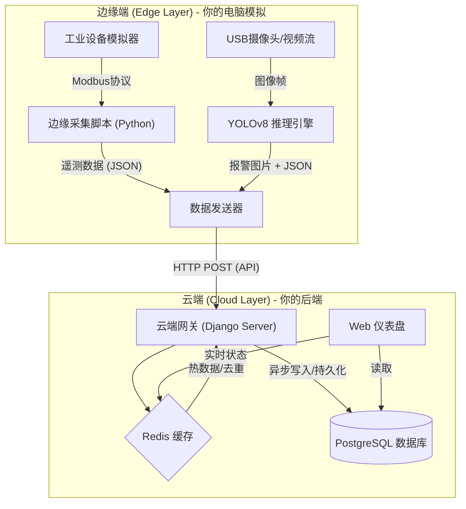

# 🏭 项目名称：工业级 AIoT 安全监测与设备管理平台
### (Industrial AIoT Sentinel Platform)

[English](README.md) | **简体中文**

---

### 1. 项目背景与简介 (Introduction)

**“让传统工厂拥有智慧大脑。”**

在现代工业 4.0 场景下，工厂面临两大痛点：一是老旧设备（PLC）数据孤岛，难以联网；二是生产安全（如工人未戴安全帽、火灾隐患）依赖人工巡检，效率低下。

本项目是一个**端云协同（Edge-Cloud Collaboration）的工业物联网平台**。
它利用**边缘计算**技术，在设备端实时采集 Modbus 工业协议数据并运行 YOLO 视觉算法；通过**云端 Django 后端**实现数据的统一接入、清洗、存储与可视化监控。

**核心价值**：
*   **实时性**：毫秒级采集设备温度、转速等遥测数据。
*   **智能化**：通过计算机视觉自动识别现场安全隐患并报警。
*   **低成本**：纯软件方案兼容各类工控机，无需昂贵专有硬件。

---

### 2. 技术栈架构 (Tech Stack)

这个项目完美覆盖了你的技能树，实现了从底层硬件协议到上层 Web 应用的全栈贯通。

| 层级 | 关键技术 | 作用描述 |
| :--- | :--- | :--- |
| **云端后端 (Server)** | **Python, Django 4.2** | 核心业务逻辑，ORM 数据建模，Admin 后台管理 |
| | **Django REST Framework (DRF)** | 构建 RESTful API，处理前后端分离的高并发请求 |
| | **Redis** | 高速缓存（存储设备在线状态）、消息队列中间件 |
| **数据库 (DB)** | **PostgreSQL 15** | 存储设备元数据、时序遥测历史、报警日志 |
| **边缘端 (Edge)** | **Python, OpenCV** | 视频流采集与图像处理 |
| | **YOLOv8 / Ultralytics** | 边缘侧 AI 推理（安全帽/火焰检测） |
| | **PyModbus** | 工业协议驱动，模拟 PLC 寄存器读写 |
| **基础设施 (Infra)** | **Docker & Compose** | 数据库与缓存服务的容器化编排 |
| **前端 (Web)** | **Django Templates + Echarts** | 服务端渲染页面，数据可视化大屏展示 |

---

### 3. 系统架构设计 (System Architecture)

我们将系统划分为**边缘侧 (Edge)** 和 **云端侧 (Cloud)** 两大部分，通过 HTTP/REST API 进行通信。

---

### 4. 核心功能模块 (Core Features)

1.  **设备接入与管理 (Device Management)**
    *   支持设备的注册、鉴权（DeviceID/Token）。
    *   实时监控设备在线/离线状态（利用 Redis 心跳机制）。

2.  **工业数据遥测 (Telemetry Ingestion)**
    *   高频接收设备上传的温度、压力、转速数据。
    *   支持 Modbus 协议数据的解析与标准化。

3.  **AI 视觉报警 (AI Visual Alert)**
    *   边缘端实时检测异常（如：检测到火焰）。
    *   自动上传报警截图、置信度、时间戳。
    *   云端生成报警日志并通知。

4.  **数据可视化大屏 (Dashboard)**
    *   展示最近 1 小时的温度变化曲线。
    *   展示最新的 AI 报警抓拍图片。

---

### 5. 你的开发环境准备 (Prerequisites)

为了实现“零硬件成本”开发，我们采用**全软件仿真**方案。

*   **操作系统**: Windows / macOS / Linux 均可。
*   **Python 环境**: Conda (建议 Python 3.10)。
*   **容器环境**: Docker Desktop (用于跑数据库)。
*   **IDE**: VS Code 或 PyCharm。

---

### 6. 验证与运行

1.  **启动 Docker**: `docker-compose up -d` (确保 Postgres/Redis 亮绿灯)。
2.  **启动 Django**:
    *   记得先在 Django Admin (`/admin`) 里手动创建一个 Device，UID 填 `SIM001`，否则接口会报 404 设备未注册。
    *   `python manage.py runserver`
3.  **启动模拟器**:
    *   `python edge_client/simulator.py`
4.  **查看成果**:
    *   模拟器终端应该显示“✅ 上传成功”。
    *   使用 DBeaver 查看 `devices_telemetry` 表，数据应该在源源不断地增加。

--- 

### 7. 可扩展性与性能优化 (Scalability & Optimization)

虽然目前的 MVP (Minimum Viable Product) 版本已经能够运行，但在面对真实工厂成千上万台设备的高并发场景时，系统架构需要进一步演进。以下是本项目的技术路线图与优化方案。

#### 7.1 通信协议升级：引入 MQTT (Message Queuing Telemetry Transport)
*   **现状**：目前设备通过 HTTP POST 上报数据。HTTP 协议头臃肿，且为短连接，高频上报时网络开销大，延迟高。
*   **优化方案**：
    *   部署 **EMQX** 或 **Mosquitto** 作为 MQTT Broker。
    *   边缘端改用 MQTT 发布 (Publish) 主题 `telemetry/device_01`。
    *   后端通过订阅 (Subscribe) 主题异步消费数据。
*   **收益**：网络带宽占用降低 80% 以上，支持弱网环境下的数据传输（QoS 机制），不仅能“上报”，还能通过 Topic 实现“下发控制指令”。

#### 7.2 时序数据库迁移：TimescaleDB / InfluxDB
*   **现状**：遥测数据存储在 PostgreSQL 的普通表中。随着时间推移，数据量将达到亿级，查询历史曲线（如“过去7天温度趋势”）会变得极慢。
*   **优化方案**：
    *   引入 **TimescaleDB**（基于 PG 的插件）或 **InfluxDB**。
    *   利用其**超表 (Hypertables)** 和 **自动分区** 特性。
    *   设置**数据保留策略 (Retention Policy)**，例如：原始数据保留 30 天，30 天后自动降采样为“1小时平均值”存档。
*   **收益**：百万级数据查询毫秒级响应，存储空间大幅压缩。

#### 7.3 异步任务解耦：Celery + RabbitMQ
*   **现状**：报警处理逻辑（保存图片、写入日志、发送邮件）目前可能在 View 中同步执行，会阻塞接口响应。
*   **优化方案**：
    *   引入 **Celery** 分布式任务队列。
    *   当检测到异常时，View 层仅发送一个 Task ID 即返回。
    *   Worker 节点在后台异步处理耗时的图片上传和通知发送。
*   **收益**：API 接口响应速度不再受第三方服务（如邮件服务器）波动影响，系统吞吐量提升。

#### 7.4 边缘侧 AI 加速：TensorRT / ONNX Runtime
*   **现状**：目前在边缘端使用 PyTorch/Ultralytics 原始模型推理，对 CPU 资源消耗极大，FPS 较低。
*   **优化方案**：
    *   将 YOLO 模型导出为 **ONNX** 通用格式。
    *   使用 **TensorRT** (针对 NVIDIA Jetson 硬件) 或 **OpenVINO** (针对 Intel CPU) 进行模型量化（FP16/INT8）。
*   **收益**：在低成本工控机上，推理速度可提升 3-5 倍，实现真正的实时视频流分析。

#### 7.5 数字孪生 (Digital Twin) 可视化
*   **未来展望**：目前使用 Echarts 二维图表。
*   **演进方向**：前端引入 **Three.js** 或 **WebGL**。
*   **效果**：构建工厂的 3D 模型，将实时温度、转速数据映射到 3D 模型上，实现设备运行状态的沉浸式监控。

--- 
### 8. 总结：
#### 1. 目标岗位 (Target Roles)

*   **Python 后端开发工程师 (Python Backend Engineer)**
    *   **核心匹配点**：Django, REST framework, PostgreSQL, Redis。
    *   **加分项**：不仅会写接口，还懂得利用 Redis 做缓存策略、处理高频并发写入（遥测数据）、设计合理的数据模型。
*   **IoT 平台开发工程师 (IoT Platform Developer)**
    *   **核心匹配点**：端云协同架构、Modbus 协议理解、设备状态管理（心跳机制）、时序数据处理。
    *   **竞争力**：这是目前制造业数字化转型中最紧缺的岗位之一。
*   **边缘计算应用工程师 (Edge Computing Engineer)**
    *   **核心匹配点**：Docker 容器化部署、OpenCV/YOLO 模型调用、轻量级硬件交互。
    *   **场景**：很多公司需要将算法落地到工控机或树莓派上，你的项目展示了这方面的能力。
*   **初级全栈工程师 (Full Stack Developer)**
    *   **核心匹配点**：如果你完成了 Echarts 大屏可视化部分，证明你有能力打通前后端数据流，交付完整产品。

#### 2. 目标行业 (Target Industries)

*   **智能制造 / 工业互联网 (Smart Manufacturing / IIoT)**
    *   **代表企业**：西门子、施耐德、海尔卡奥斯、三一重工、各类工业软件初创公司。
    *   **契合度**：100%。你的项目背景直接切中“工厂数字化”和“安全巡检”两大刚需。
*   **智慧能源 / 电力 (Smart Energy)**
    *   **场景**：电网设备监控、风力发电机状态监测。
    *   **通用性**：都需要采集传感器数据、实时报警、历史回溯。
*   **智慧物流 / 仓储 (Smart Logistics)**
    *   **场景**：AGV 小车状态监控、仓库防火/防盗（视觉报警）。
*   **安防监控 (Security & Surveillance)**
    *   **场景**：视频流分析、异常行为检测。